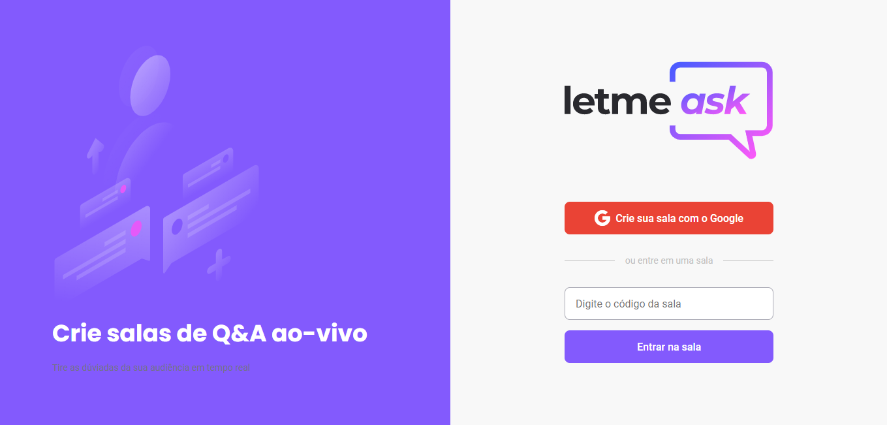
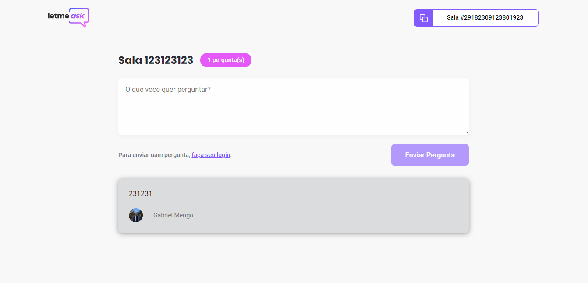
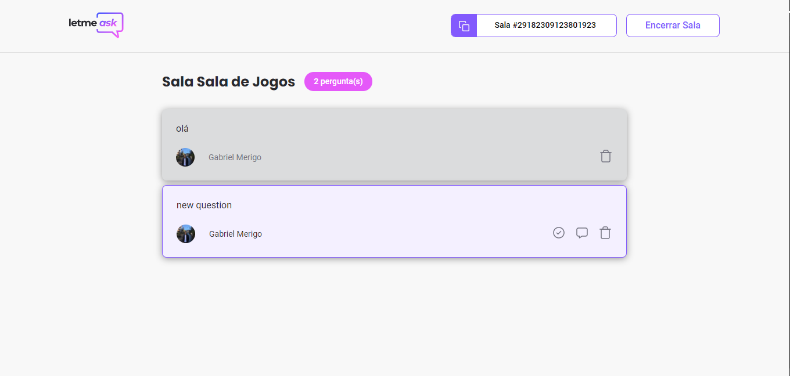
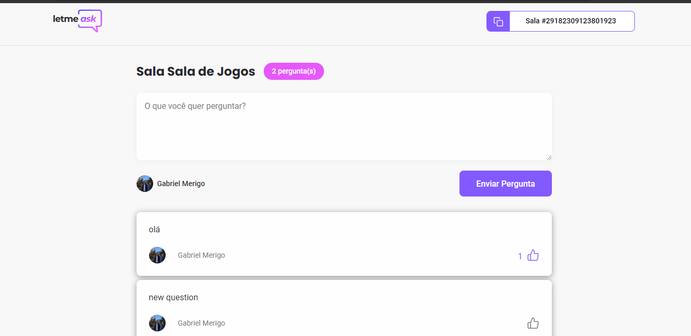

<div align="center">
  
</div>

# Let me ask
Aplicação desenvolvida na Next Level Week Together!
---
Deploy: https://letmeask-84b90.web.app

<h5 align="center">
Let me ask é uma plataforma que cria salas de Q&A ao vivo onde os espectadores podem enviar e votar em perguntas para serem respondidas. 
</h5>

### Tecnologias
Esse projeto foi desenvolvido utilizando as seguintes tecnologias:

- [ReactJS](https://reactjs.org/)
- [Typescript](https://www.typescriptlang.org/)
- [Firebase Authentication](https://firebase.google.com/products/auth)
- [Firebase Realtime Database](https://firebase.google.com/products/realtime-database)

### Rodando o projeto

Clonando o projeto
```bash
https://github.com/gabrielmerigo/nlw6-letmeask.git
```

Instalando as dependências
```bash
yarn
```

Iniciando o projeto
```bash
yarn start
```

### Aplicação desenvolvida


---

---

---

